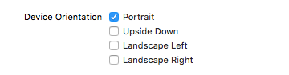
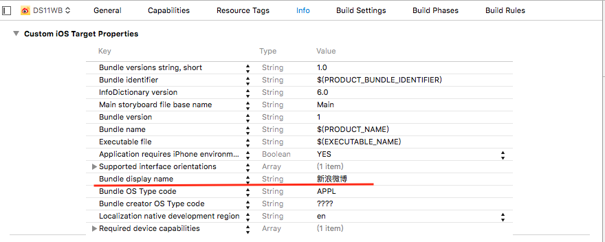

#初始化项目
- 项目的部署版本
    - 之后项目会运行在哪些系统中
- 横竖屏的支持
    - iPhone应用一般只支持横屏
    - iPhone游戏一般支持竖屏
    - iPad横竖屏都支持

- 设置项目的图标和启动图片
    - 项目的图标(美工做好)
    - 项目的启动图片(美工做好)
- 修改项目的名称
    - Bundle Display Name

- 项目的目录结构
    - 项目最外层是UITabbarController
    - 微博包含:主页/消息/发现/我/发表微博
    - 并且控制器都是UITableViewController

