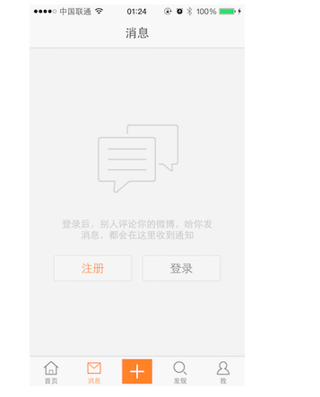
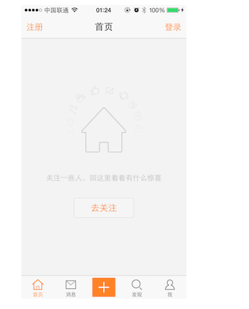
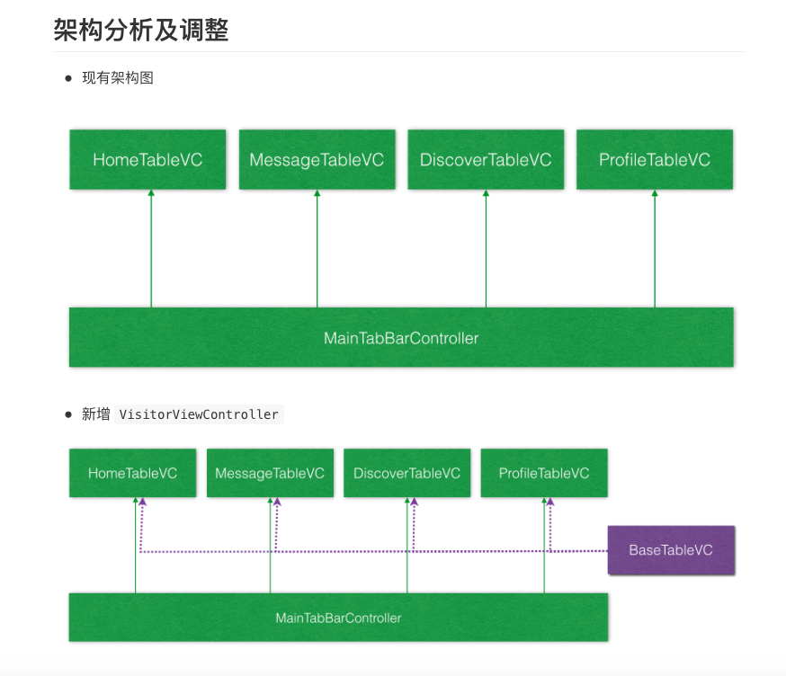

#访客视图
##访客视图的目标
- 如果用户没有登录，显示访客视图，提示用户注册或者登录

##课程重点

- 1.自定义 TableViewController 的基类 VisitorViewController
- 2.自定义访客视图，用代码实现苹果原生的自动布局
- 3.设置全局外观

##应用实例
- 在实际应用开发中，有可能会出现：
    - 功能框架已经构建完成
    - 产品经理提出新的功能需求
    - 而新提出的功能需求，会对已有的架构产生影响
    - 例如，在新浪微博中，已经搭建好程序架构，但是如何应对用户登录的处理呢？

##新的需求 —— 未登录页面

##界面截图

