#测试打包
##打包流程
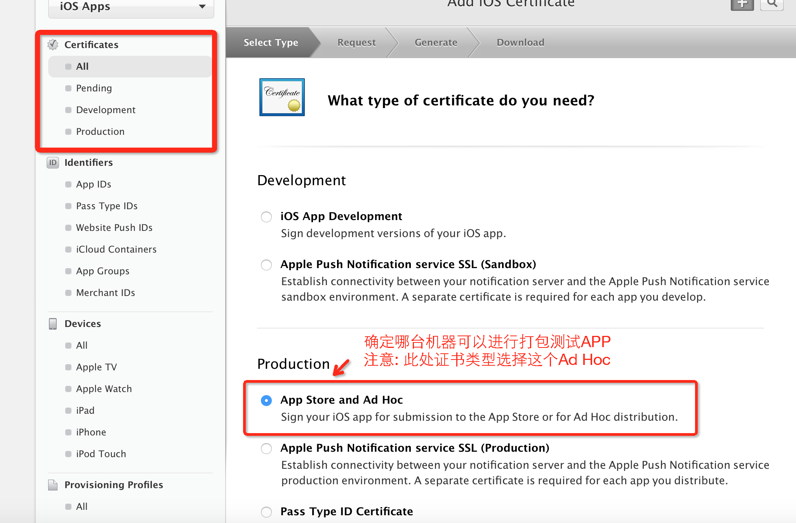

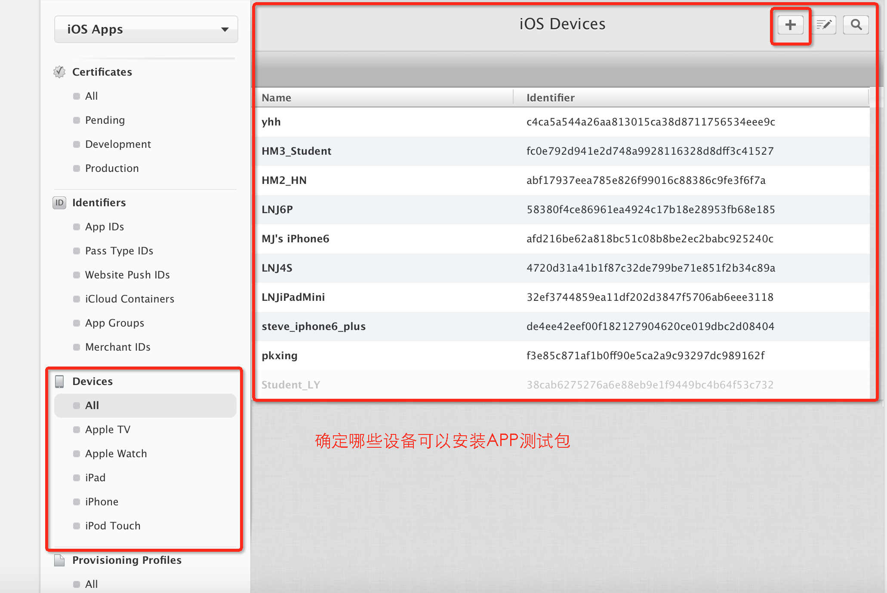
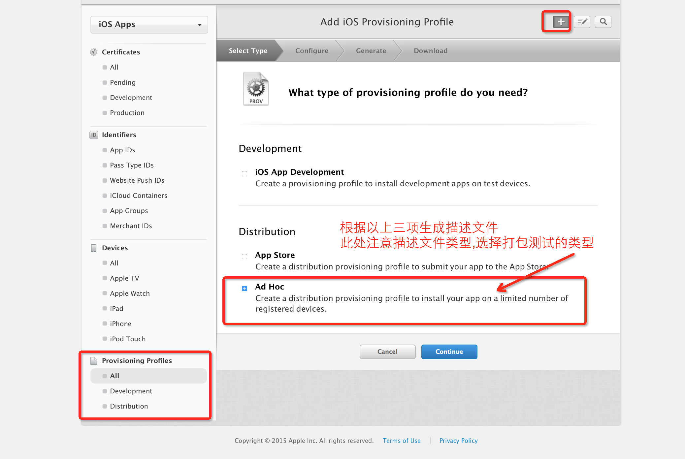
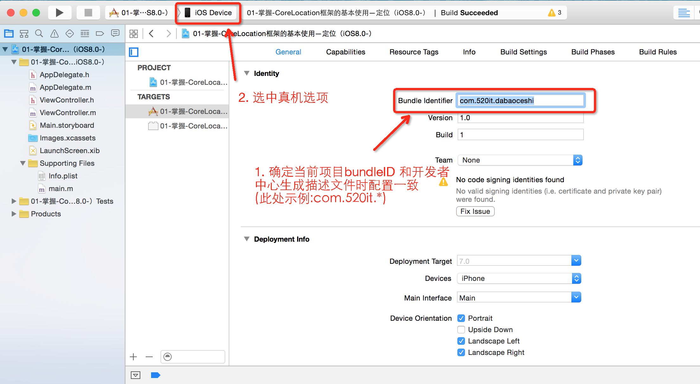
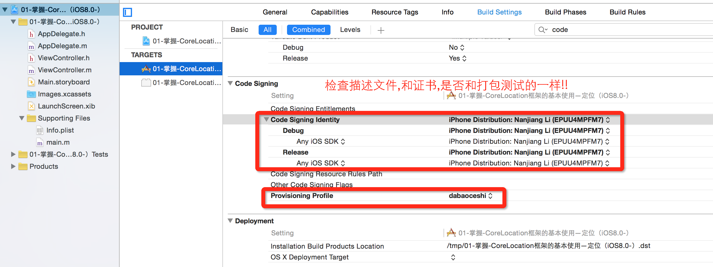
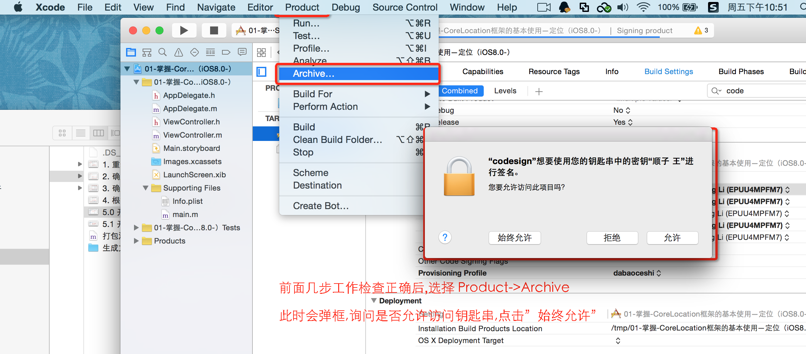
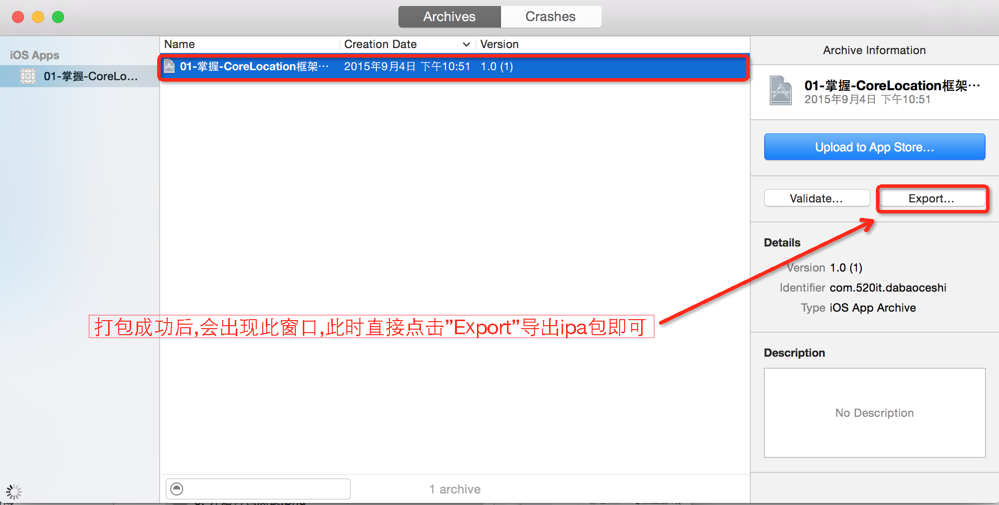
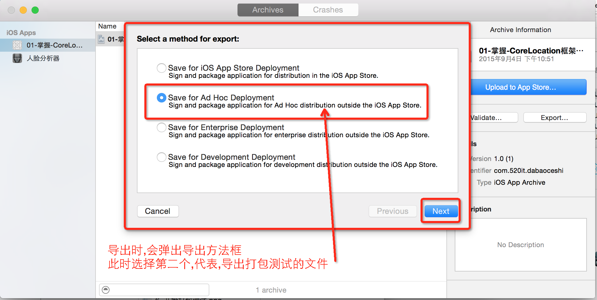
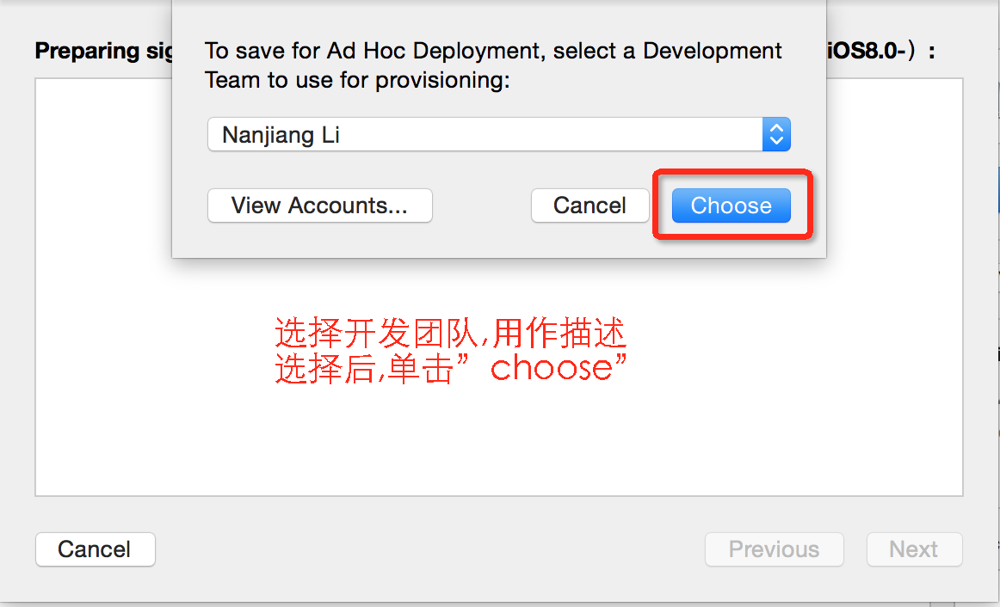
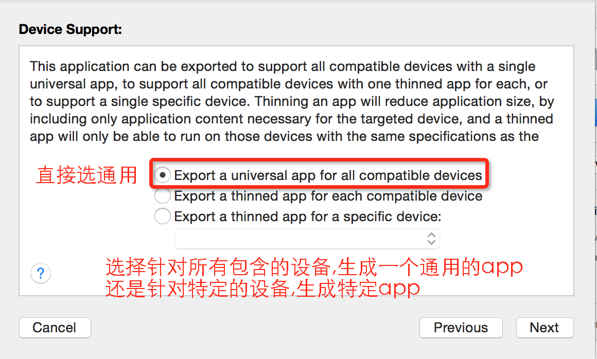
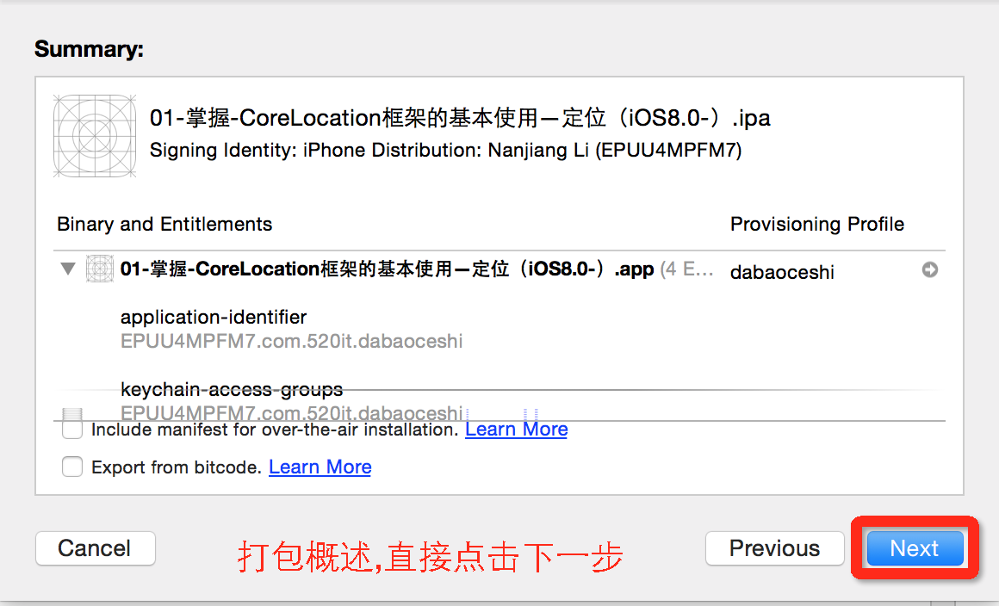

- xcode 设置

#打包常见错误
-因为证书过期了，所以要下载新的证书
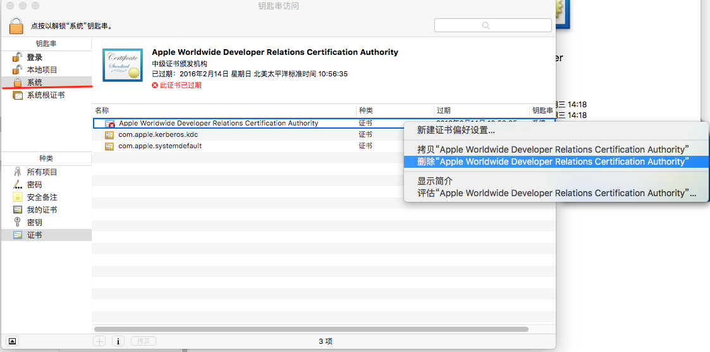

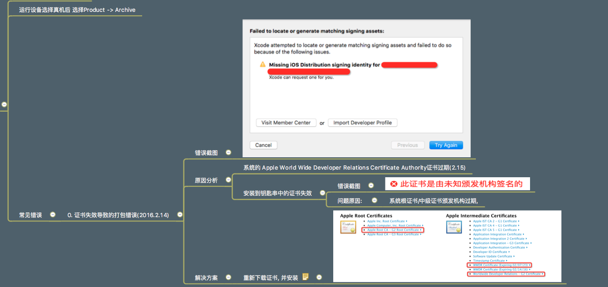

- 证书列表链接:
https://www.apple.com/certificateauthority/

- 需要下载的证书链接:
http://developer.apple.com/certificationauthority/AppleWWDRCA.cer

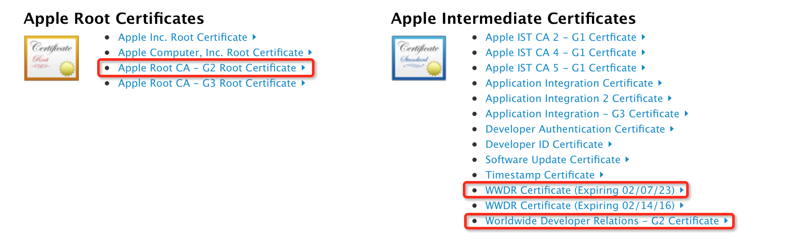
