#真机调试

##如何进行真机调
- 1、登录开发者账号，然后添按证书，然后打开keychain，打开证书助手，然后从证书颁发机构请求证书，然后生成CSR(证书签名请求)文件，然后上传

- 2、填写App Id (我们应用程序中的Bundle ID)

- 3、添加Device ID即UDID；

- 4、最后根据证书、App ID、Device ID生成描述文件（mobileprovision文件）

##点击mobileprovision生成的文件，可以在下面删除
~/Library/MobileDevice/Provisioning Profiles

APP发布的上架流程
1.登录应用发布网站添加应用信息；
2.下载安装发布证书；
3.选择发布证书，使用Archive编译发布包，用Xcode将代码（发布包）上传到服务器；
4.等待审核通过;
5.生成IPA：菜单栏->Product->Archive.

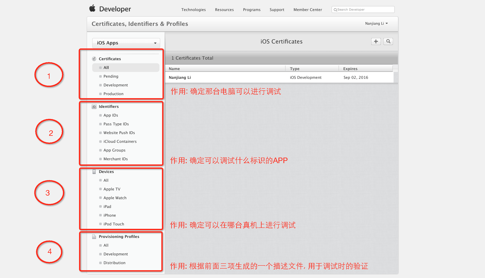
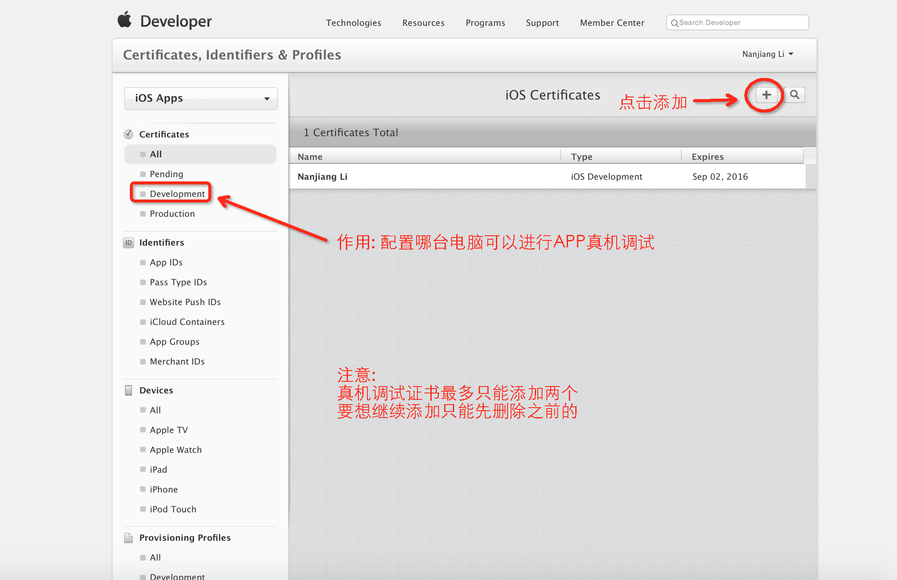
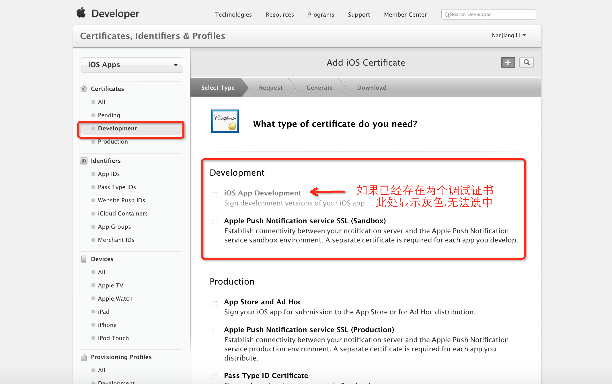
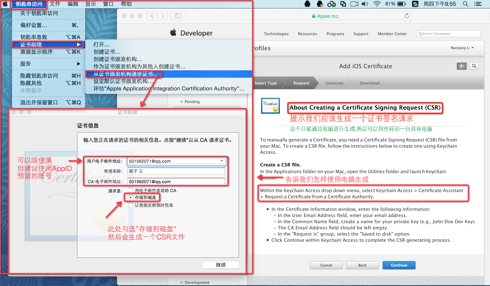
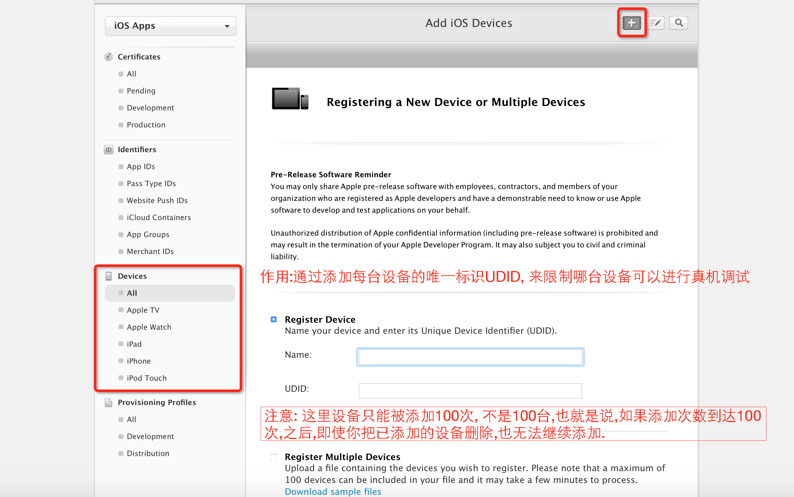
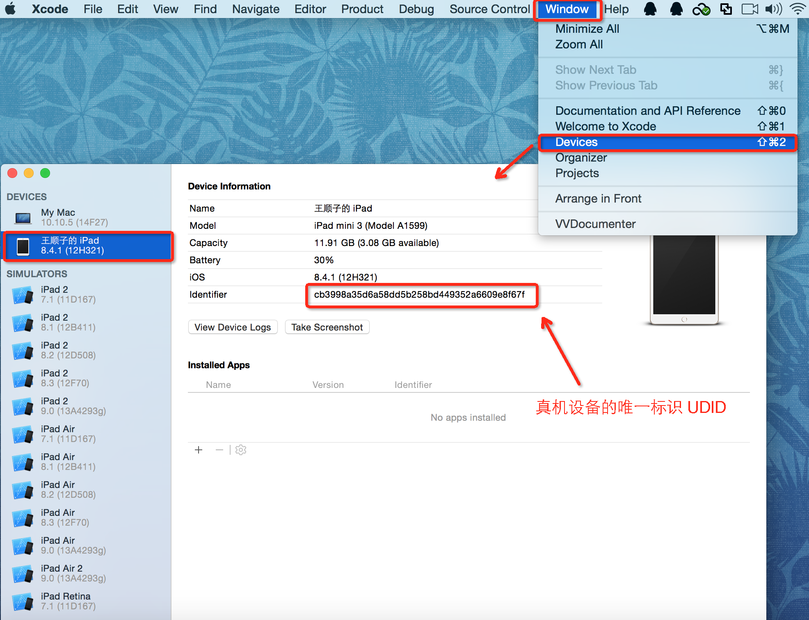
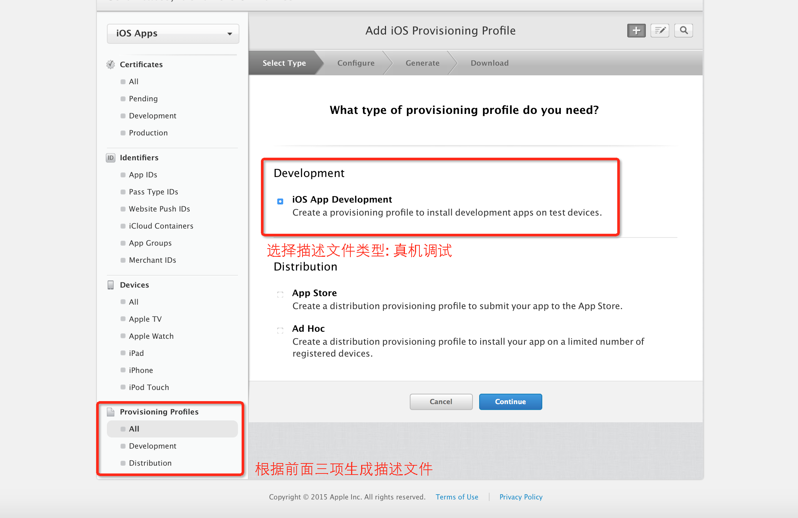
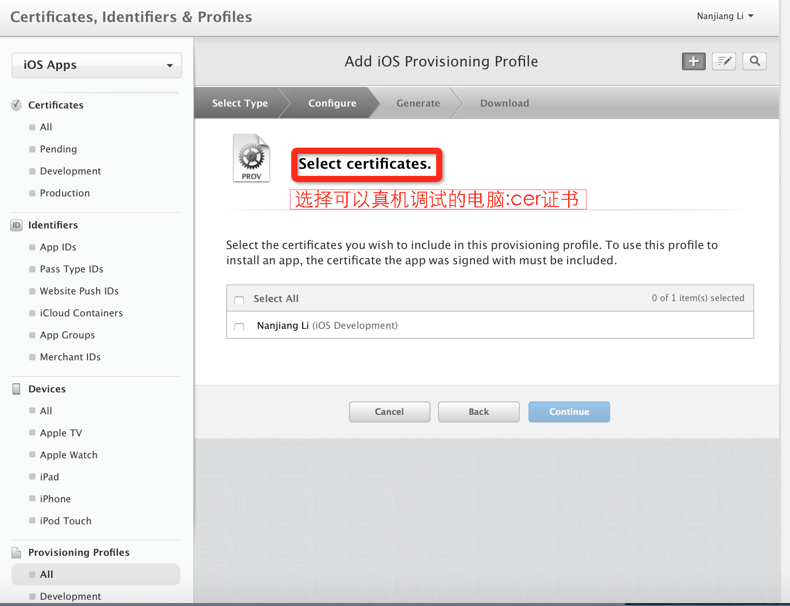
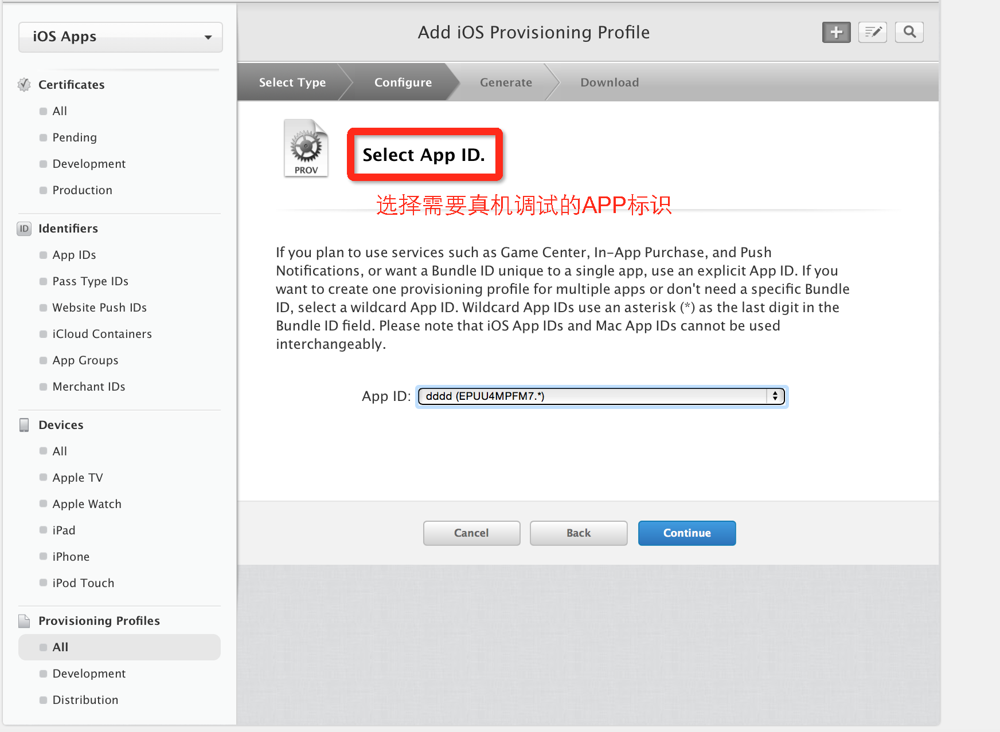
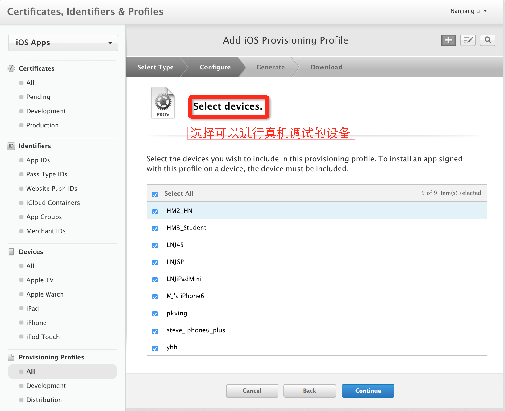
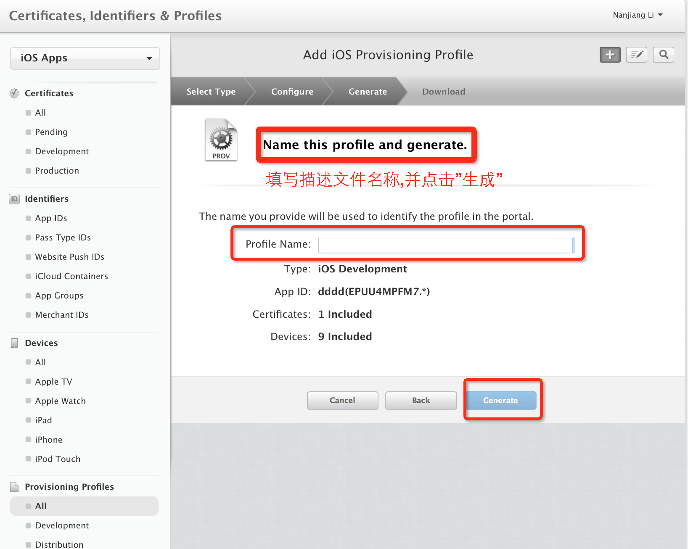
- xcode 设置
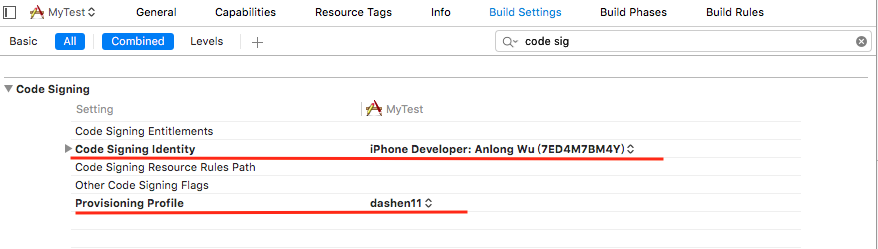
