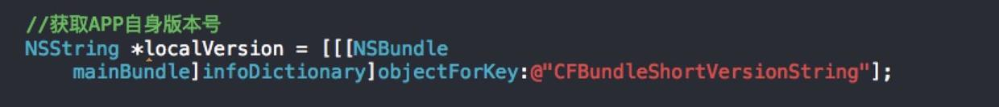
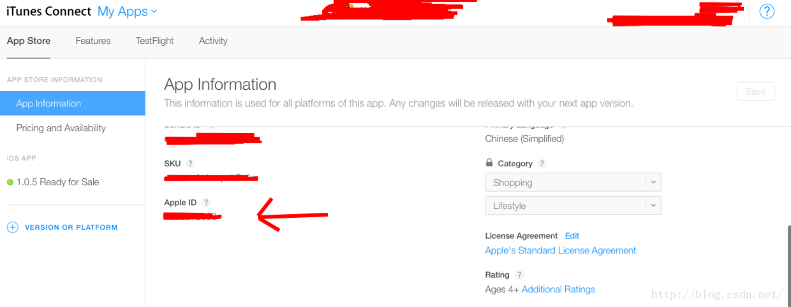
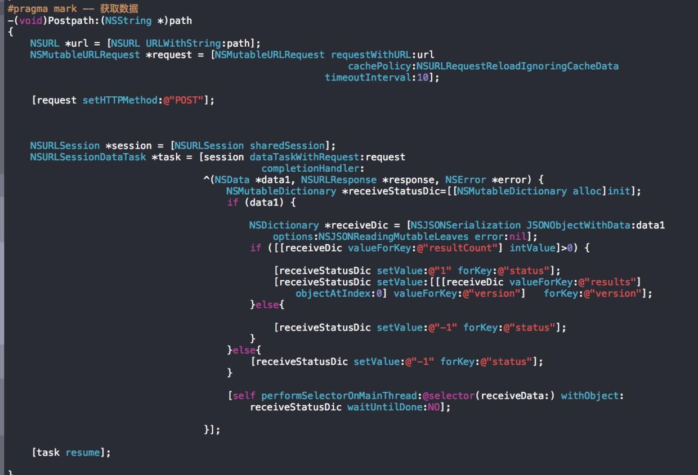

# IOS Update
http://www.jianshu.com/p/4c63a52713ff

> 每一个APP都会迭代更新，针对更新问题，小小的总结一下。
> 提示版本的两种更新方式

* 1.在设置界面有 “检查更新”处，检查版本是否更新，这个需要和后台的工作人员配合，根据后台提供的接口做出合理的判断，根据 “版本号”的比较来处理时候更新

    

* 2. 第二种就是启动App时提示更新（详细的说明一下）

    
    > (1)实现思路如下

    a:取自身的版本号

    b:取AppStore版本号

    c:两个版本号比较

    d:提示框的显示和跳转到AppStore

    > (2)代码实现

    a:取自身的版本号
    
    
    b:取AppStore版本号
    首先要在开发者网站上获取你的AppID,
    
    ```swift
        NSString *url = [[NSString alloc] initWithFormat:@"http://itunes.apple.com/lookup?id=%@",@"你的AppID"];
    ```
    

