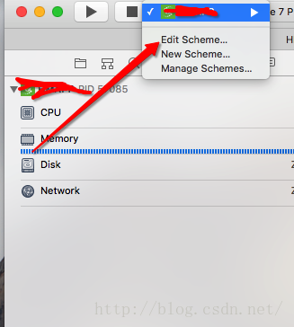
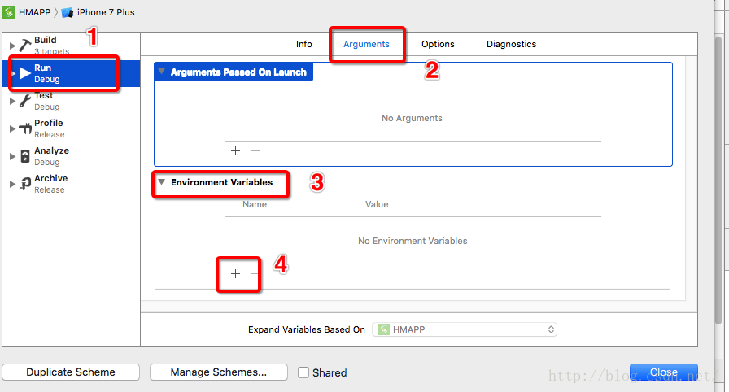

#xcode8 Log
- 我相信所有更新完Xcode8,然后运行程序,给我们直观的感受就是多出了很多Log.只要做简单的设置就可以把启动运行这些log去掉

- Product→Scheme→Edit Scheme 中设置Name为OS_ACTIVITY_MODE,Value为disable.如图:

第三步：
添加参数：
Name ：OS_ACTIVITY_MODE
Value :  disable

