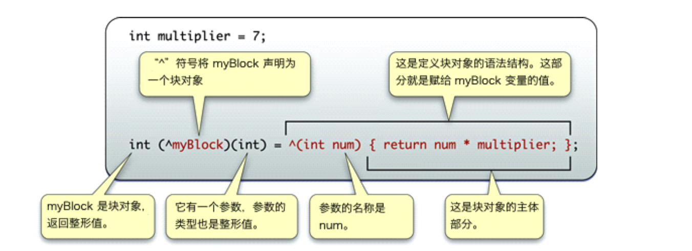

# Block基本概念
##本小节知识点:
1. 【了解】什么是Block
2. 【理解】block的格式

---

##1.什么是Block
- Block是iOS中一种比较特殊的数据类型

- Block是苹果官方特别推荐使用的数据类型, 应用场景比较广泛
    + 动画
    + 多线程
    + 集合遍历
    + 网络请求回调

- Block的作用
    + 用来保存某一段代码, 可以在恰当的时间再取出来调用
    + 功能类似于函数和方法

---


##2.block的格式
- Block的定义格式

```objc
返回值类型 (^block变量名)(形参列表) = ^(形参列表) {

};
```



- block最简单形式

```objc
void (^block名)() = ^{代码块;}

例如:
void (^myBlock)() = ^{ NSLog(@"李南江"); };
```
- block带有参数的block的定义和使用

```objc
void (^block名称)(参数列表)
= ^ (参数列表) { // 代码实现; }

例如:
void (^myBlock)(int) = ^(int num){ NSLog(@"num = %i", num); };
```
- 带有参数和返回值的block

```objc
返回类型 (^block名称)(参数列表)
= ^ (参数列表) { // 代码实现; }

例如:
int (^myBlock)(int, int) = ^(int num1, int num2){ return num1 + num2; };
```

- 调用Block保存的代码

```objc
block变量名(实参);
```

---
